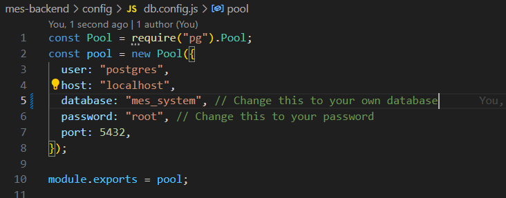

# Introduction

This project is configured and uses NextJS for frontend, Express JS for backend, and Postgresql for database.

1. The frontend and backend is seperated into 2 folders. To succesfully run, user need to have or configure a Postgresql database.
2. Next, update the database config in `\mes-backend\config\db.config.js` to follow the user's Postgresql setup.
   
3. Open terminal and change directory to `/mes-backend`. Run `npm install`, and run `npm run dev` to start the server. If user has nodemon installed, user can replace `npm run dev` with `npm run nodemon` instead to benefit nodemon functionality.
4. Open another terminal and change directory to `/mes-frontend-v2`. Run `npm install`, and run `npm run dev` to start the server.
5. The backend server will run on port 8000, and frontend will run on port 3000
